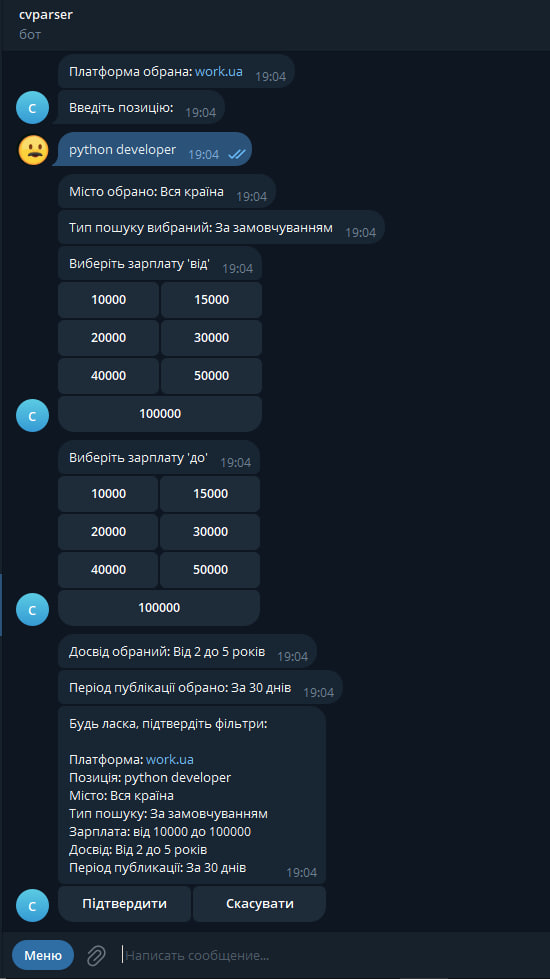
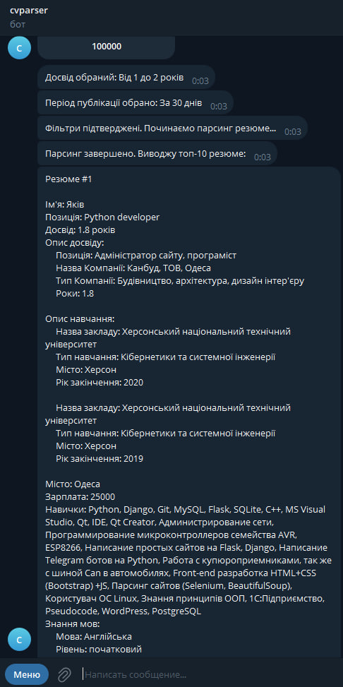
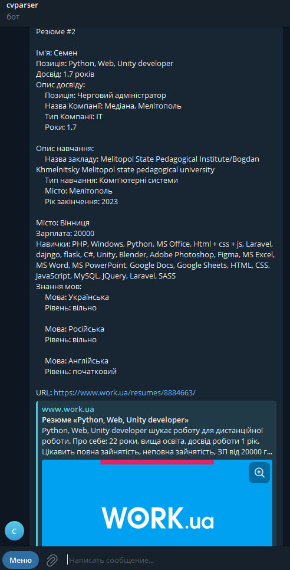

# cv-parser
Parser which allows parsing and sorting of resumes from popular job websites and interfaces with a Telegram bot for user-friendly interactions.

## Installation
Python3 must be already installed

You need to write your credentials to .env file like in .env.sample
```
EMAIL, PASSWORD from robota.ua
API_KEY from https://app.exchangerate-api.com/dashboard
BOT_TOKEN from https://t.me/BotFather
```

```shell
git clone https://github.com/nicksetrakov/cv-parser
cd cv-parser
python3 -m venv venv
source venv/bin/activate
pip install -r requirements.txt
python bot.py
```
## Features

*  Inline buttons for selecting a parsing platform and for selecting filters
* Brought salaries to a unified format in hryvnia using exchangerate api
* I sort candidates by their relevance depending on experience, completeness of resume and availability of skills
* Solved the scalability problem by saving the resume to the database and adding the score field for quick sorting
* Add logging to file and console

## Examples:


